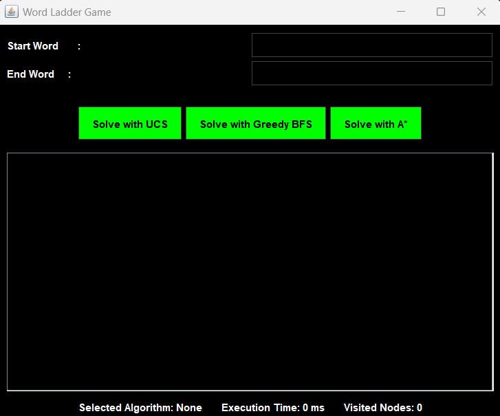

<h1 align="center"> Tugas Kecil 3 </h1>
<h2 align="center"> IF2211 Strategi Algoritma </h2>
<h3 align="center">Penyelesaian Permainan Word Ladder Menggunakan Algoritma UCS, Greedy Best First Search, dan A*</h3>


## Table of Contents
1. [General Information](#general-information)
2. [Requirements Program](#required_program)
3. [How to Run The Program](#how-to-run-the-program)
4. [Project Status](#project-status)
5. [Project Structure](#project-structure)
6. [Contributors](#contributors)


## General Information
This project is a word ladder solver implemented in Java. It utilizes three different algorithms: Uniform Cost Search (UCS), Greedy Best-First Search (GBFS), and A* to find the shortest path between two words by transforming one word into another, changing one letter at a time, with each intermediate word also being a valid word in a given dictionary.

## Requirements Program
|   NO   |  Required Program                    |                                         Reference Link                                         |
| :----: | :----------------------------------: | :--------------------------------------------------------------------------------------------: |
|   1    | Java Development Kit (JDK)           | [Windows](https://www.oracle.com/java/technologies/javase-jdk11-downloads.html) <br> [Linux](https://openjdk.java.net/install/) |
|   2    | Windows Subsystem for Linux (WSL)    | [WSL](https://learn.microsoft.com/en-us/windows/wsl/install)                                  |
|   3    | Ubuntu 22.04.3 LTS                   | [Ubuntu](https://ubuntu.com/download/desktop)                                                 |
                                             |


## How to Run The Program
1. Clone this repository 
```bash
git clone https://github.com/Benardo07/Tucil3_13522055.git
 ```
2. Change the directory to the root directory
```bash
cd Tucil3_13522055
```
3. Compile and run the program using script file
- Windows : 
```bash
./run
```
- Linux (make sure the run.sh file if in LF mode): 
```bash
chmod +x run.sh
./run.sh
```
4. Alternatively, you can compile and run the program manually using the following steps for both (Linux and Windows):
- Compile the Java files:
```bash
javac -d ./bin src/*.java
```
- Run the program:
```bash
java -cp ./bin Main
```

## Project Status
This project has been completed and can be executed.


## Project Structure
```bash

.
├── bin/
│   ├── dictionary.txt
│   ├── DictionaryLoader.class
│   ├── Main.class
│   ├── Node.class
│   ├── SolverResult.class
│   ├── WordLadderGUI.class
│   └── WordLadderSolver.class
├── src/
│   ├── DictionaryLoader.java
│   ├── Main.java
│   ├── Node.java
│   ├── ResultSolver.java
│   ├── WordLadderGUI.java
│   └── WordLadderSolver.java
├── doc/
│   └── Tucil3_13522055.pdf
├── README.MD
├── run.bat
└── run.sh                                 
        
```

## Documentaion
### Graphical User Interface (GUI)



## Contributors

|   NIM    |                  Nama                  |
| :------: | :------------------------------------: |
| 13522055 |                Benardo                 |

